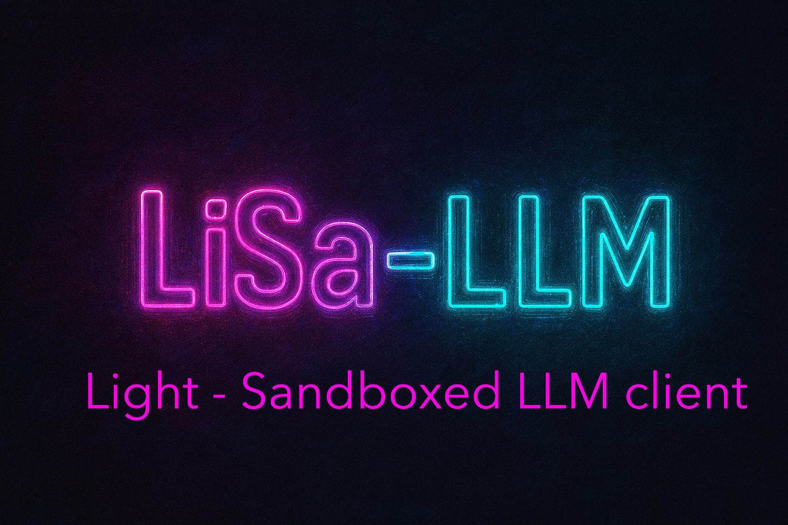

<div align="center">
  
  <h1>LiSa-LLM – Lightweight, Sandboxed LLM Inference Server</h1>
  <p><em>“Because your cat‑sized model deserves a lion‑sized sandbox.”</em></p>
  <p><strong>LiSa-LLM is a production‑grade, self‑contained C++20 inference server for transformer models, using <strong>GGML with CUDA</strong> for tensor computations. It features a hardened Linux sandbox (namespaces, seccomp, cgroup v2, pivot_root), API key authentication, TLS support, streaming Server‑Sent Events, and full GPU acceleration. Perfect for edge deployments or whenever you need to run untrusted models without losing sleep.</strong></p>
  <p>
    
    
    
    <a href="https://github.com/sponsors/Yog-Sotho" target="_blank" rel="noopener">
      
    </a>
  </p>
</div>

## Features

- 🧠 **Full transformer** – multi‑head attention, RoPE, SwiGLU, KV cache, layer norm, residual connections – all implemented with GGML.
- 🔒 **Hardened sandbox** – the model runs in a separate process with:
  - User, mount, PID, and network namespaces
  - `pivot_root` into an empty tmpfs
  - Strict seccomp‑bpf whitelist (only ~30 syscalls)
  - cgroup v2 memory limit
  - Drop to `nobody` privileges
- 🌐 **HTTP API** with optional TLS (mTLS ready) and API key authentication.
- 📡 **Real‑time streaming** via Server‑Sent Events (SSE).
- ⚡ **GPU acceleration** – automatic CUDA offloading (configurable layer count).
- 📦 **No external ML frameworks** – just GGML, C++20, and a few header‑only libs.
- 🔁 **Model integrity checks** (SHA‑256) before loading.
- 💾 **GGUF format support** – load any LLaMA‑based model out of the box.

## Build & Run

### Dependencies

- CMake ≥ 3.20
- C++20 compiler (GCC 11+, Clang 14+)
- OpenSSL (for TLS and SHA‑256)
- libseccomp (Linux only, for sandbox)
- yaml-cpp
- CUDA toolkit ≥ 11.0 (for GPU support, optional)
- pthread, dl, rt (standard on Linux)

All other libraries (`ggml`, `cpp-httplib`, `nlohmann/json`) are bundled in `third_party/`.

### Compile

```bash
mkdir build && cd build
cmake .. -DCMAKE_BUILD_TYPE=Release -DENABLE_CUDA=ON -DENABLE_TLS=ON -DENABLE_SANDBOX=ON
make -j$(nproc)
```

Prepare a Model

Download any GGUF model (e.g., from HuggingFace) and place it in a directory. You'll also need the matching vocab.json and merges.txt (for the tokenizer). Example using a small LLaMA‑2 7B:

```bash
wget https://huggingface.co/TheBloke/Llama-2-7B-Chat-GGUF/resolve/main/llama-2-7b-chat.Q4_K_M.gguf
wget https://huggingface.co/TheBloke/Llama-2-7B-Chat-GGUF/resolve/main/vocab.json
wget https://huggingface.co/TheBloke/Llama-2-7B-Chat-GGUF/resolve/main/merges.txt
```

Update config.yaml with the paths.

Run

```bash
./lisa
```

You should see logs like:

```json
{"timestamp":1743696000000,"level":"info","message":"Loading model","path":"./models/llama-2-7b-chat.Q4_K_M.gguf"}
{"timestamp":1743696000123,"level":"info","message":"Model loaded","n_layer":32,"n_embd":4096,"gpu":true}
{"timestamp":1743696000124,"level":"info","message":"Starting server","bind":"127.0.0.1:8080","tls":false}
```

Test the API

```bash
# Health check
curl http://localhost:8080/healthz

# Generate a completion (streaming)
curl -X POST http://localhost:8080/v1/completions \
  -H "Content-Type: application/json" \
  -H "X-API-Key: changeme" \
  -d '{"prompt": "Once upon a time", "max_new_tokens": 100, "temperature": 0.7, "top_p": 0.9}'
```

The response will be a Server‑Sent Events stream:

```
data: {"token":"Once"}
data: {"token":" upon"}
data: {"token":" a"}
...
data: [DONE]
```

Configuration

Edit config.yaml to your liking. Example:

```yaml
model_path: "./models/llama-2-7b-chat.Q4_K_M.gguf"
vocab_path: "./models/vocab.json"
merges_path: "./models/merges.txt"

listen_addr: "127.0.0.1"
listen_port: 8080
enable_tls: false
cert_file: ""
key_file: ""
api_key: "changeme"          # set to empty string to disable auth

n_threads: 8
max_context: 4096
temperature_default: 0.8
top_p_default: 0.95
max_new_tokens_default: 256

memory_limit_bytes: 4294967296   # 4 GiB
sandbox_enabled: true
use_gpu: true
gpu_layers: 100                  # offload all layers to GPU
```

Security Notes

· The sandbox is only available on Linux and requires a kernel with user namespaces enabled (most distros have it).
· The model file is memory‑mapped read‑only; the sandboxed process runs in a tmpfs new root, so any model‑internal file writes are lost.
· For extra paranoia, run the whole binary under a dedicated user account (e.g., lisa).
· If you expose the server to the internet, always enable TLS and set a strong API key.

Limitations

· Only CPU and NVIDIA GPU via CUDA are supported. AMD/Intel GPUs would require additional backend work.
· The tokenizer is a full GPT‑2 BPE implementation but does not yet support byte_fallback or added_tokens from modern models. It works for LLaMA‑2/3 and GPT‑2.
· The server does not yet support batch inference (concurrent requests are serialized). This is planned for a future release.

Contributing

Fork, hack, and open a PR. Keep the humour and the seccomp filters tight.

License

MIT – because sharing is caring, even when sandboxing.

---

<div align="center">
  Made with ❤️ by Yog-Sotho<br>
  <i>“May your logits be low‑entropy and your cgroups never OOM.”</i>
</div>
